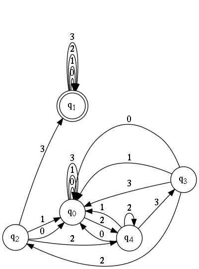
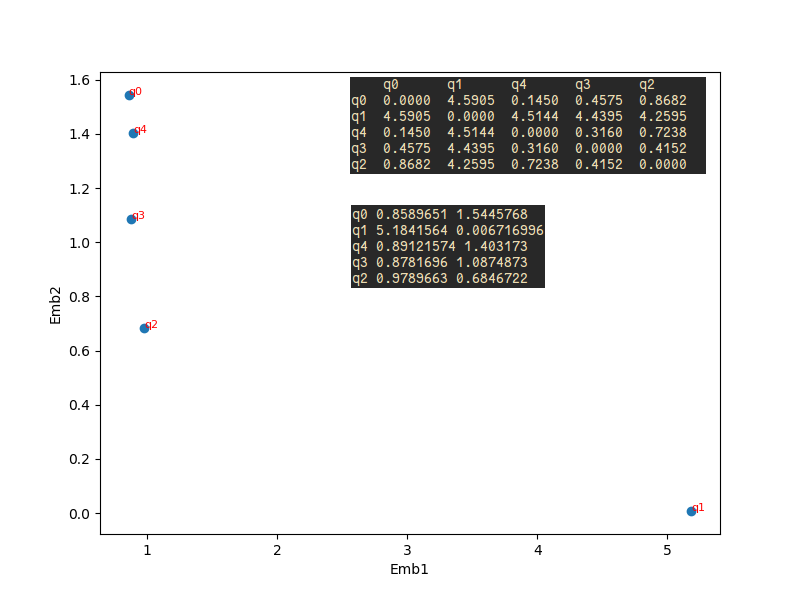
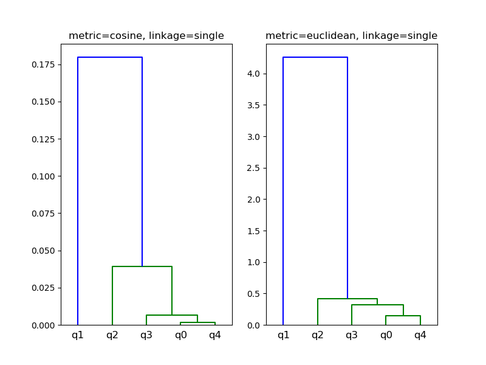
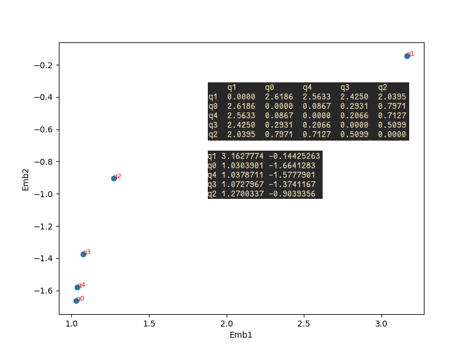
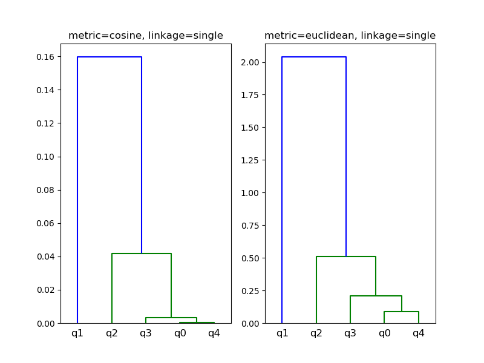
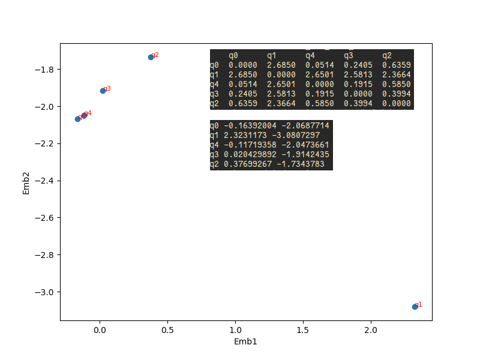
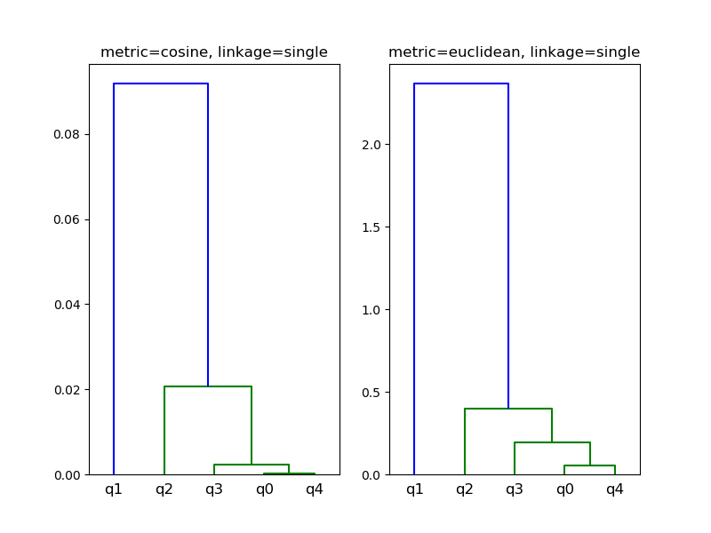

Regex
---
[0-3]\*(23){2}[0-3]\*

```sh
=> python dfa.py dfa.dot BFS_dfa.node2vec BFS_walks.txt BFS_emb_plot.png BFS_dendrogram.png

=> cat BFS_dfa.node2vec
5 2
q0 0.8589651 1.5445768
q1 5.1841564 0.006716996
q4 0.89121574 1.403173
q3 0.8781696 1.0874873
q2 0.9789663 0.6846722
```


BFS
---



DFS
---



BFS+DFS
---


