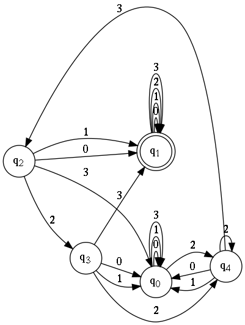
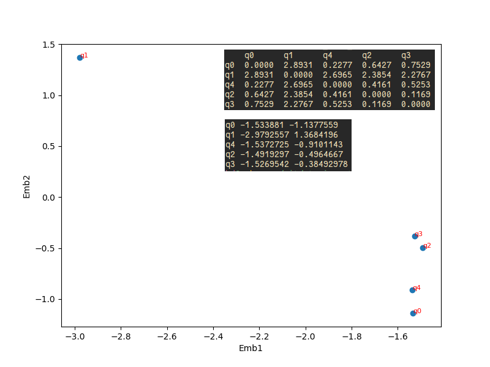
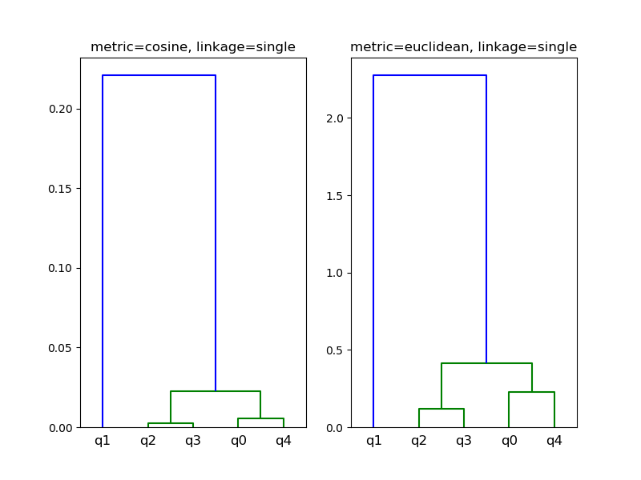
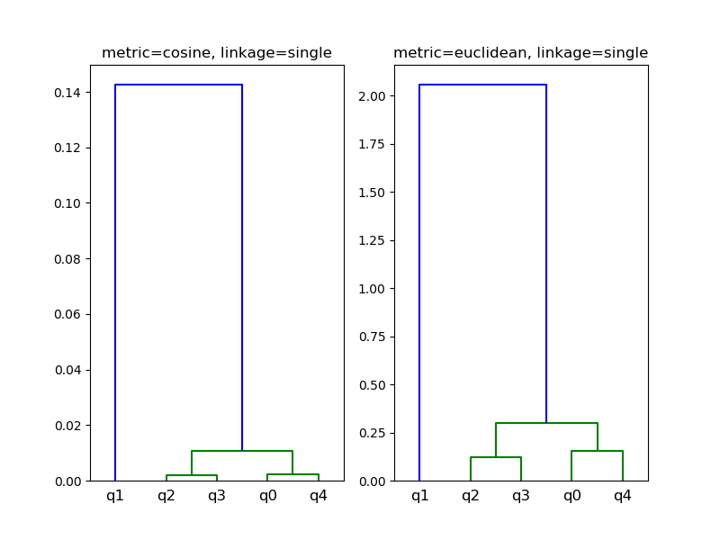
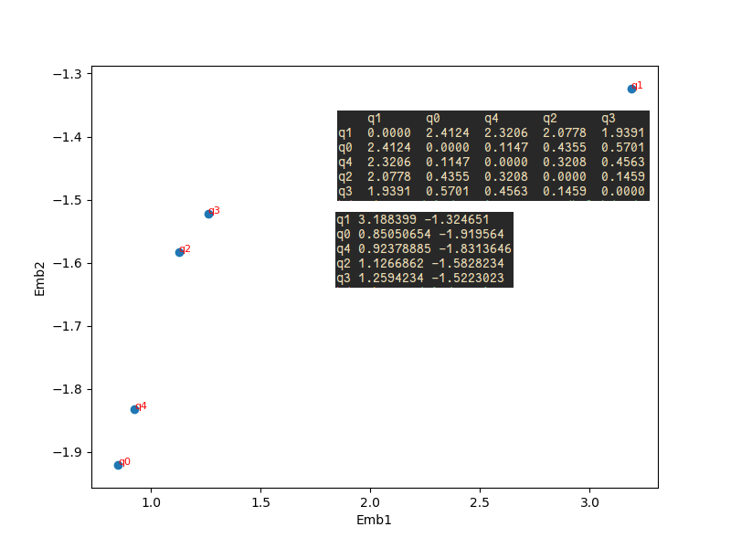
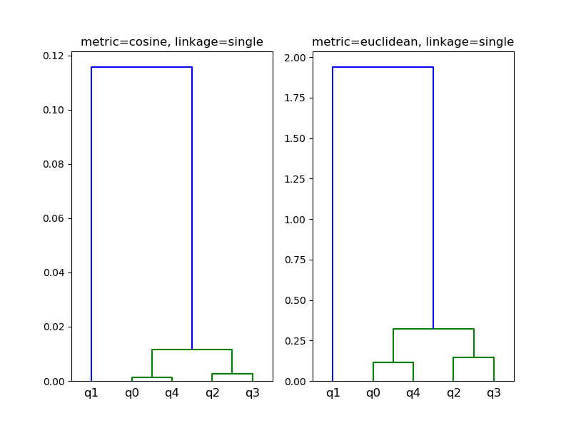

Regex
---
[0-3]\*(23){2}[0-3]\*|[0-3]\*(23)(0|1)[0-3]\*

```sh
=> python dfa.py dfa.dot BFS_dfa.node2vec BFS_walks.txt BFS_emb_plot.png BFS_dendrogram.png

=> cat BFS_dfa.node2vec
5 2
q0 -1.533881 -1.1377559
q1 -2.9792557 1.3684196
q4 -1.5372725 -0.9101143
q2 -1.4919297 -0.4964667
q3 -1.5269542 -0.38492978
```


BFS
---



DFS
---



BFS+DFS
---


