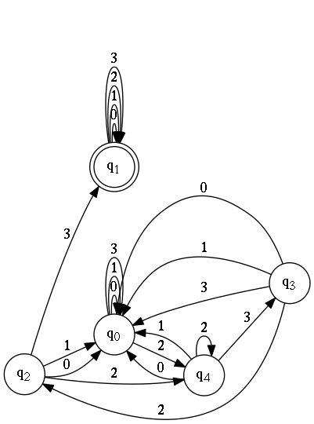

RESTful web service for converting regex to DFA. I'll add more DFA operations as we need them down the road.

Create an executable jar:
===
```bash
=> cd regex2dfa
=> mvn package
=> ln -s target/regex2dfa.jar .
=> java -jar regex2dfa
```

Example query: http://localhost:8080/regex2dfa2dot/q/[0-3]\*(23){2}[0-3]\*/

- **8080:** port number (can be changed in config.properties)
- **regex2dfa2dot:** service name
- **q:** denotes state initials (can be changed to **s**)
- **[0-3]\*(23){2}[0-3]\*:** regex
- any character (**.**) is not defined as a token. We have to use **[0-3]** instead of **(.)**

Parsing the results in Python:
```python
>>> import requests
>>> response = requests.get('http://localhost:8080/regex2dfa2dot/q/[0-3]*(23){2}[0-3]*/')
>>> dot = response.json()['dfaInDot']
>>> print(dot)
digraph DFA {
  rankdir = LR;
  "q1" [shape=doublecircle, label=<q<sub>1</sub>>];
  "q1" -> "q1" [label="0"]
  "q1" -> "q1" [label="1"]
  "q1" -> "q1" [label="2"]
  "q1" -> "q1" [label="3"]
  "q0" [shape=circle, label=<q<sub>0</sub>>];
  "q0" -> "q0" [label="0"]
  "q0" -> "q0" [label="1"]
  "q0" -> "q4" [label="2"]
  "q0" -> "q0" [label="3"]
  "q2" [shape=circle, label=<q<sub>2</sub>>];
  "q2" -> "q0" [label="0"]
  "q2" -> "q0" [label="1"]
  "q2" -> "q4" [label="2"]
  "q2" -> "q1" [label="3"]
  "q3" [shape=circle, label=<q<sub>3</sub>>];
  "q3" -> "q0" [label="0"]
  "q3" -> "q0" [label="1"]
  "q3" -> "q2" [label="2"]
  "q3" -> "q0" [label="3"]
  "q4" [shape=circle, label=<q<sub>4</sub>>];
  "q4" -> "q0" [label="0"]
  "q4" -> "q0" [label="1"]
  "q4" -> "q4" [label="2"]
  "q4" -> "q3" [label="3"]
}

>>> import graphviz
>>> dfa = graphviz.Source(dot, format='png')
>>> dfa.render(view=True)
```


